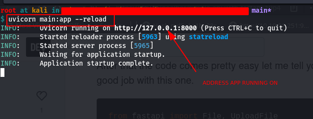
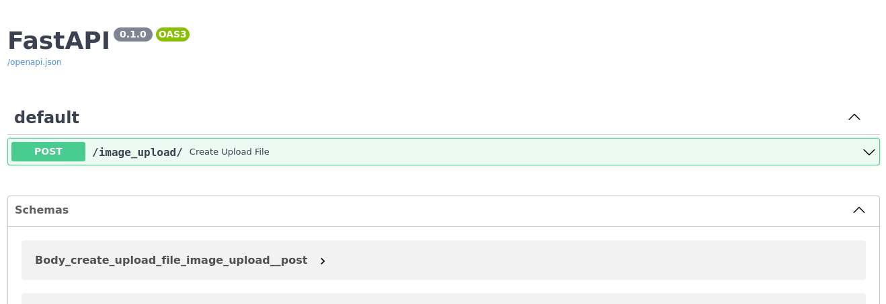
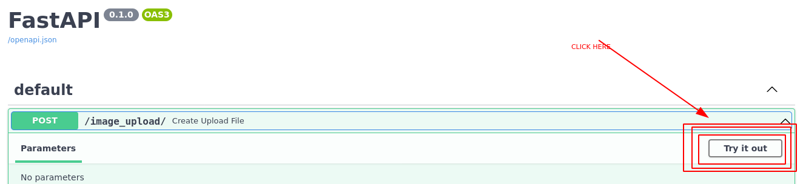
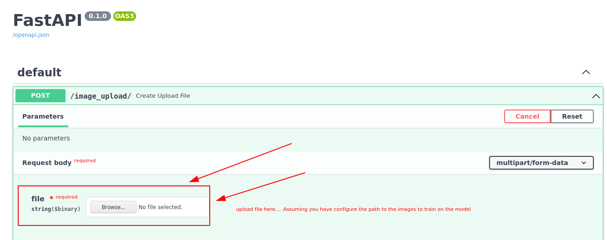

## Facial Recognition Application / Script
- Based on the python facial recognition library, Fastapi for python API design

### Tech Stack

- FastAPI (API framework)
- Uvicorn (server)
- Python-multipart (Form data)

## Installation
- clone the repo or move the train.py, app.py and requirements.txt file to your project file directory
- To install the dependencies

```python
pip install -r requirements.txt
```

## Starting the local webserver or API



- Navigate to http://127.0.0.1:8000/docs#/ & get the documentation of the API






## Starting the local server in development

```bash
uvicorn main:app --reload
```

## Directory Structure


