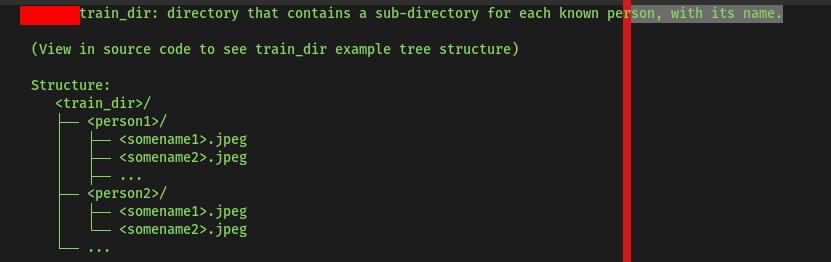

## Facial Recognition Application / Script
- Based on the python facial recognition library, Fastapi for python API design

### Assumption

- You have handled the correct data type posted ie its an images, and also the file extensions
- You have limited the size of your uploads to a certain file limit, this helps not overload the server 
- You have a delay period just to wait for the response from server 


### Tech Stack

- Flask (web framework)

## Installation
- clone the repo or move the train.py, app.py and requirements.txt file to your project file directory
- To install the dependencies

```python
pip install -r requirements.txt
```

## Starting the local webserver or API

```bash

python main.py  

```

## Testing with curl

```bash
curl -iL -X POST -H "Content-Type: multipart/form-data" -F "image=@test_bezos.jpeg" http://127.0.0.1:8000/postimage
```

## Train Directory Structure
- Contains the images to train the model please note the structure



