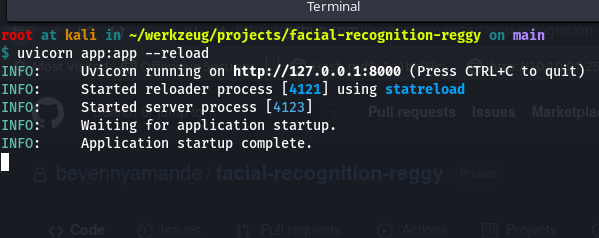

# Facial Recognition Application / Script
- Based on the python facial recognition library, Fastapi for python API design

# Installation
- clone the repo or move the train.py, app.py and requirements.txt file to your project file directory
- To install the dependencies

```python
pip install -r requirements.txt
```
# Starting the local webserver or API



- Navigate to http://127.0.0.1:8000/docs#/ & get the documentation of the API


# Starting the local server in development

```bash
uvicorn app:app --reload
```

